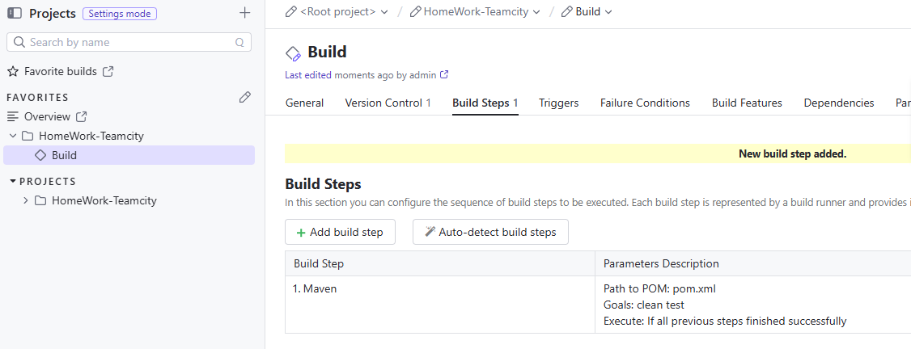
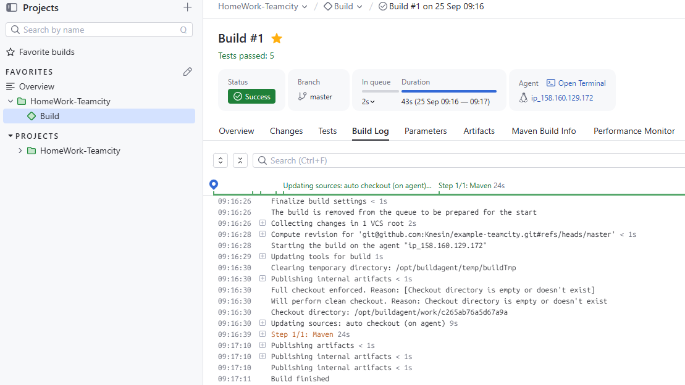
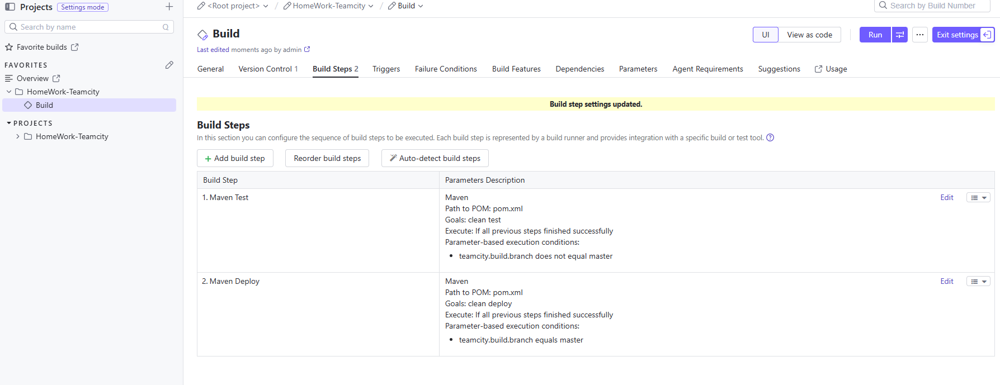
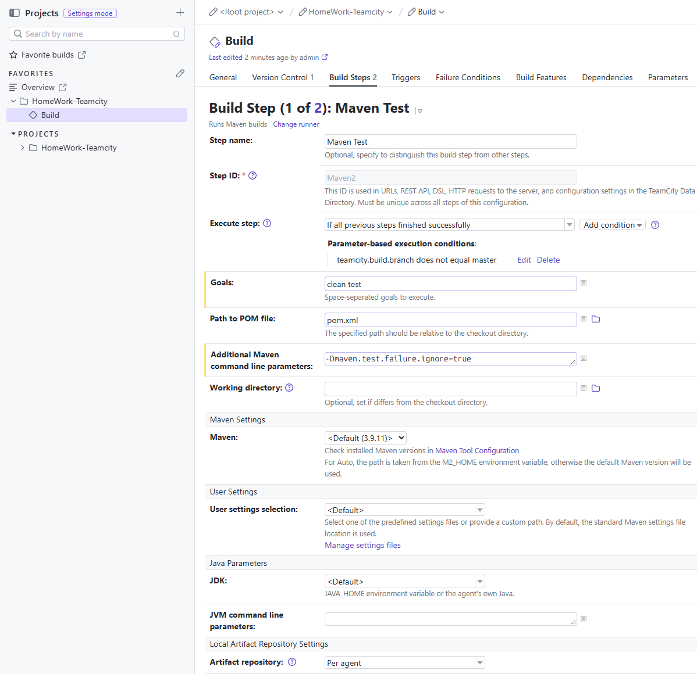
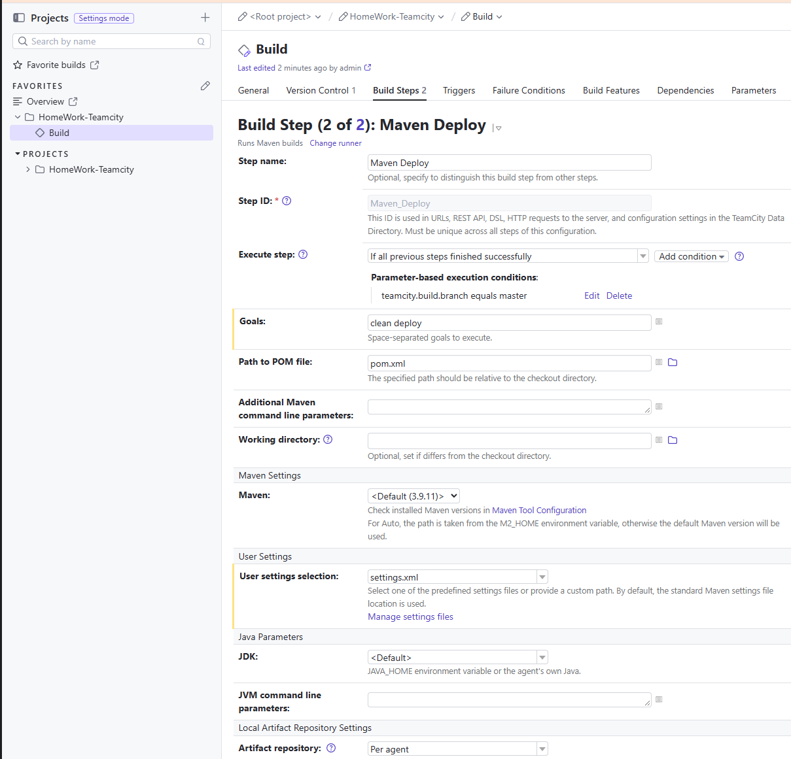
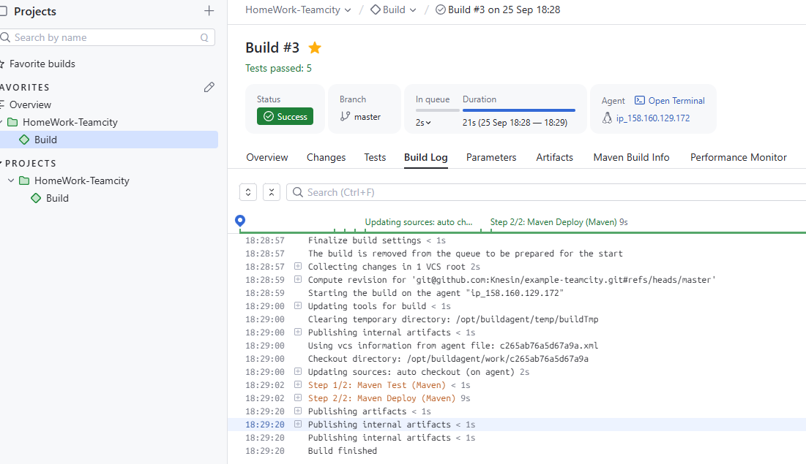
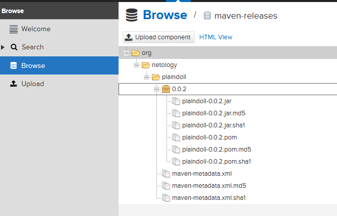
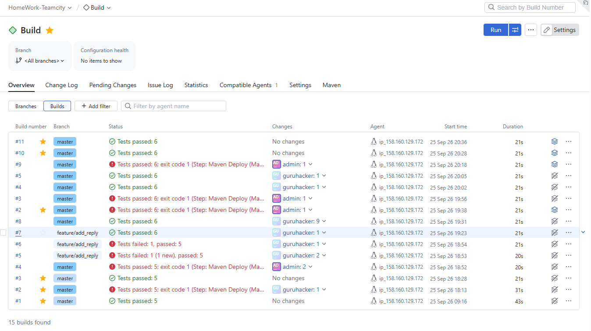
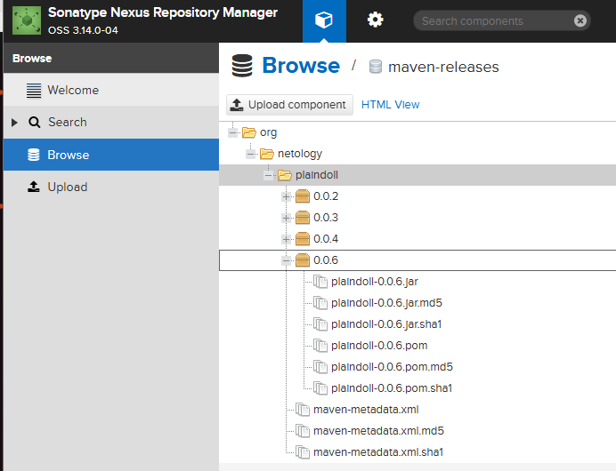

# Домашнее задание к занятию 11 «Teamcity»!

1. Первая конфигурация 

 

2. Запуск первой конфигурации

 

3. Настойка 2х условий сборки 

 

4. 1ое условие

 

5. 2ое условие

6. Выполнение

 

7. Артефакт

 

8. Выполенные сборки

 

9. Артефакты

